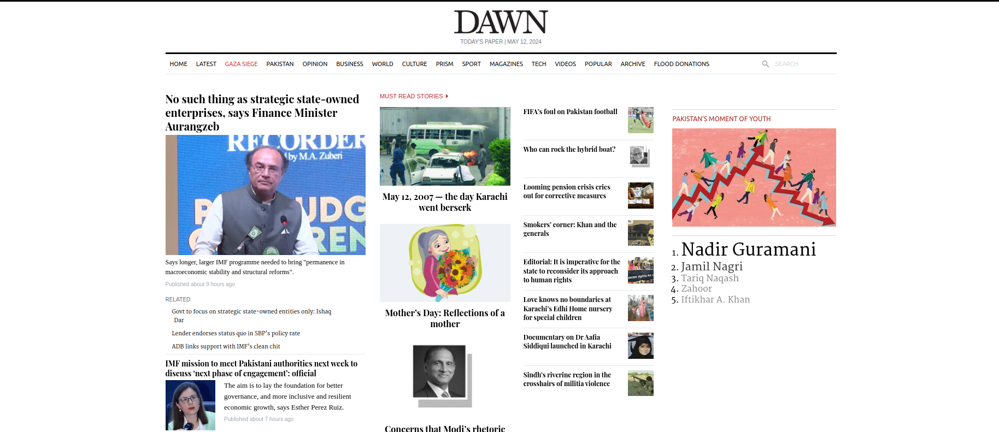
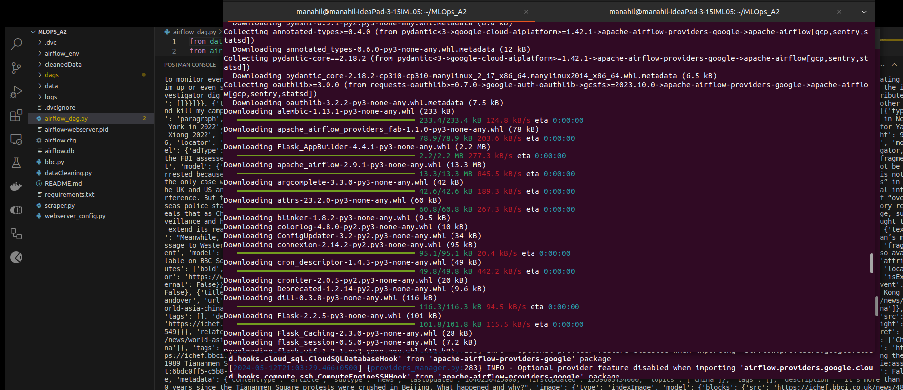
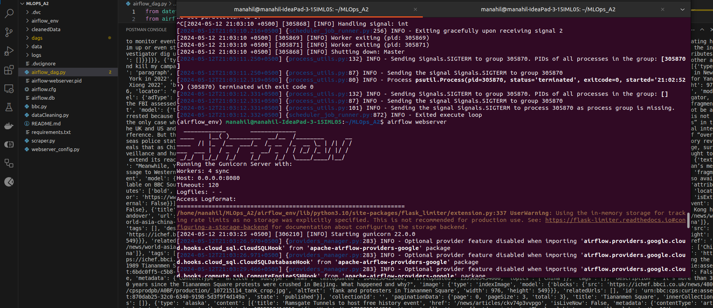
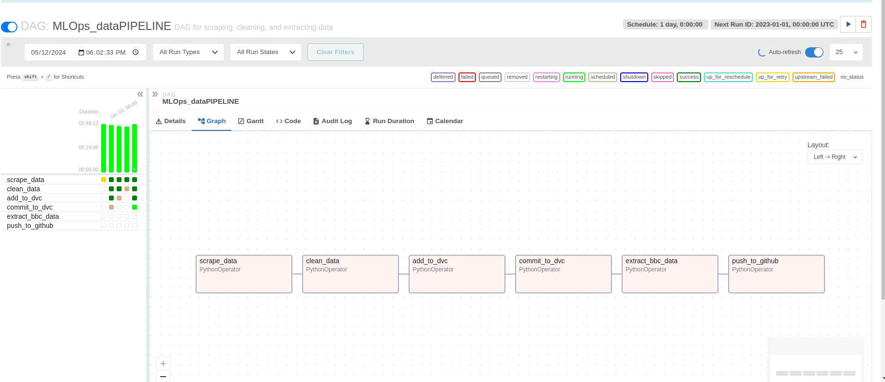

# MLOps_A2
Constructed a data pipeline using airflow.
# Data Pipeline Assignment Report

## Introduction
This report documents the setup, code, and execution steps for the data pipeline assignment. The assignment involves creating a data pipeline with Apache Airflow to extract data, clean it, add it to DVC (Data Version Control), extract specific data, push cleaned data to Google Drive, and push changes to GitHub.

## Tasks
### 1. Setup
- **Objective**: Setup Apache Airflow environment and project structure.
- **Steps**:
  - Installed Apache Airflow.
  - Created a new directory named `data-pipeline`.
  - Initialized a Git repository.
  - Initialized a DVC repository.

### 2. Data Extraction
- **Objective**: Extract data from external sources.
- **Tasks**:
  - Wrote a scraper script (`scraper.py`) to extract data from websites.
  - Ran the scraper script to generate `bbc.txt` and `dawn.txt` files.

### 3. Data Cleaning
- **Objective**: Clean the extracted data.
- **Tasks**:
  - Wrote a data cleaning script (`dataCleaning.py`) to clean the extracted data.
  - Ran the data cleaning script to generate `cleaned_bbc.txt` and `cleaned_dawn.txt` files.

### 4. DVC Integration
- **Objective**: Integrate DVC for data versioning.
- **Tasks**:
  - Added the cleaned data files to DVC.
  - Committed the changes to DVC.

### 5. Data Extraction (BBC)
- **Objective**: Extract specific data from the BBC source.
- **Tasks**:
  - Wrote a script (`bbc.py`) to extract data from the BBC source.
  - Ran the script to extract data and append it to `cleaned_dawn.txt`.

### 6. Google Drive Integration
- **Objective**: Push cleaned data to Google Drive.
- **Tasks**:
  - Set up Google Drive API credentials.
  - Wrote a script (`pushToGoogleDrive.py`) to push cleaned data to Google Drive.
  - Ran the script to push data to Google Drive.

### 7. GitHub Integration
- **Objective**: Push changes to GitHub.
- **Tasks**:
  - Committed the changes to the GitHub repository.

## Conclusion
The data pipeline has been successfully implemented using Apache Airflow, DVC, Google Drive, and GitHub. Each step of the pipeline, from data extraction to pushing changes to GitHub, has been documented and executed.

